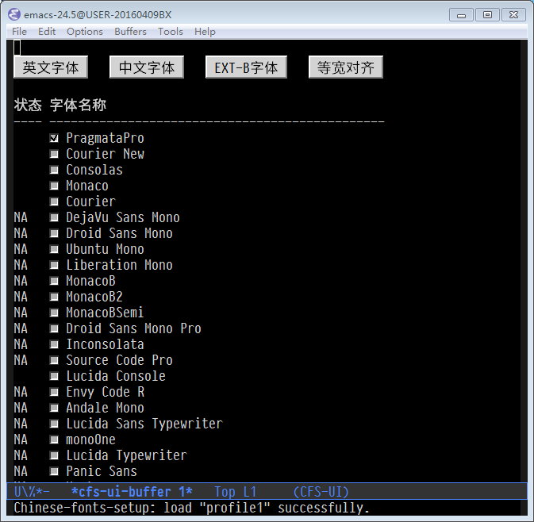
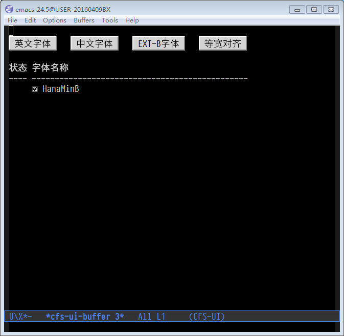
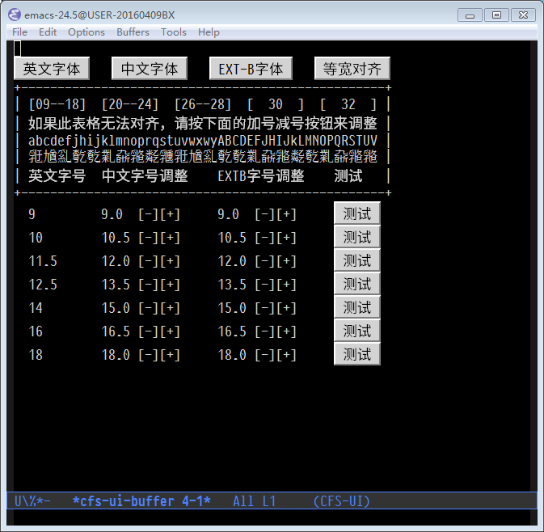
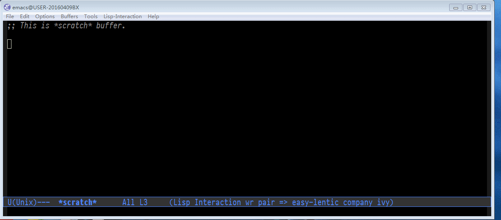
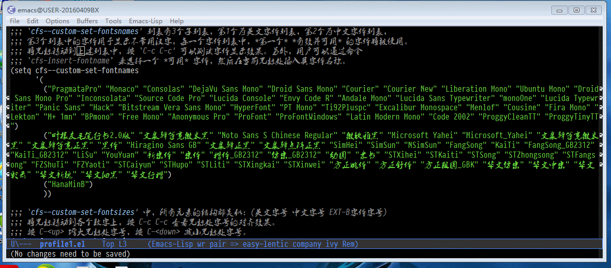

- [Chinese-fonts-setup README](#chinese-fonts-setup-readme)
  - [简介](#简介)
  - [基本原理](#基本原理)
  - [使用特点](#使用特点)
  - [下载安装](#下载安装)
  - [配置使用](#配置使用)
    - [profile 简介](#profile-简介)
    - [使用 cfs-edit-profile 命令调整 profile](#使用-cfs-edit-profile-命令调整-profile)
    - [使用 cfs-edit-profile-without-ui 命令编辑 profile](#使用-cfs-edit-profile-without-ui-命令编辑-profile)
    - [使用 cfs-regenerate-profile 重置 profile](#使用-cfs-regenerate-profile-重置-profile)
    - [调整字体大小](#调整字体大小)
    - [让 chinese-fonts-setup 随着 emacs 自动启动](#让-chinese-fonts-setup-随着-emacs-自动启动)
  - [Tips](#tips)
  - [参考文章](#参考文章)

# Chinese-fonts-setup README

## 简介

Chinese-fonts-setup 是一个 emacs 中英文字体配置工具。可以比较方便地实现中文字体和英文字体等宽（也就是大家常说的中英文对齐）。

注： 这个 package 特别适用于需要处理中英文混合表格的中文 org-mode 用户。

## 基本原理

Chinese-fonts-setup 的核心很简单，就是让中文字体和英文字体使用不同的字号，从而实现中英文对齐，它和下面的样例代码原理是一样的：

    (set-frame-font "-unknown-PragmataPro-normal-normal-normal-*-*-*-*-*-*-0-iso10646-1")
    (dolist (charset '(kana han symbol cjk-misc bopomofo))
      (set-fontset-font (frame-parameter nil 'font)
                        charset (font-spec :family "Microsoft Yahei" :size 16)))

## 使用特点

Chinese-fonts-setup 添加了许多辅助工具，使配置和调节字体和字号的工作更加简便快捷，它有几个优点：

1.  安装即用：Chinese-fonts-setup 内置字体 fallback 功能，只需安装，就能够配置中文字体和英文字体，让中文可以 **正确** 显示（但未必完美），不会因为 emacs 配置中指定的字体不存在而报错。
2.  设置方便：Chinese-fonts-setup 自带一个 profile 文件调整工具，这个工具有直观的图形界面，可以让用户设置字体名称和字体大小，分分钟实现中文字体和英文字体的等宽对齐。

## 下载安装

1.  配置melpa源，参考：<http://melpa.org/#/getting-started>
2.  M-x package-install RET chinese-fonts-setup RET
3.  在emacs配置文件中（比如: ~/.emacs）添加如下代码：

        (require 'chinese-fonts-setup)
        ;; 让 chinese-fonts-setup 随着 emacs 自动生效。
        ;; (chinese-fonts-setup-enable)
        ;; 让 spacemacs mode-line 中的 Unicode 图标正确显示。
        ;; (cfs-set-spacemacs-fallback-fonts)

## 配置使用

### profile 简介

一个 profile 代表了一套字体配置，chinese-fonts-setup 使用 profile 的概念，来维护多套字体配置，从而实现特定的环境使用特定的字体配置，比如：在编程时使用 “Consolas + 微米黑”，在阅读文章时使用 “PragmataPro + 黑体”，等等。

每一个 profile 都对应一个 emacs-lisp 文件, 保存在 \`cfs-profiles-directory' 目录中,
这些文件包含了英文字体设置，中文字体设置以及中文字体大小。

Chinese-fonts-setup 默认使用三个 profile: profile1, profile2 和 profile3,
如果想使用其它有意义的名称，可以设置:

    (setq cfs-profiles
        '("program" "org-mode" "read-book"))

切换 profile 的命令：

<table border="2" cellspacing="0" cellpadding="6" rules="groups" frame="hsides">

<colgroup>
<col  class="org-left" />

<col  class="org-left" />
</colgroup>
<thead>
<tr>
<th scope="col" class="org-left">Command</th>
<th scope="col" class="org-left">Help</th>
</tr>
</thead>

<tbody>
<tr>
<td class="org-left">cfs-switch-profile</td>
<td class="org-left">选择并切换 profile</td>
</tr>

<tr>
<td class="org-left">cfs-next-profile</td>
<td class="org-left">直接切换到下一个profile</td>
</tr>
</tbody>
</table>

### 使用 cfs-edit-profile 命令调整 profile

如果 **当前使用** 的字体不符合使用习惯，用户可以运行 \`cfs-edit-profile' 命令来调整 **当前** profile,
这个命令会弹出一个图形化界面，类似：

### 使用 cfs-edit-profile-without-ui 命令编辑 profile

有经验的用户可以使用 \`cfs-edit-profile-without-ui' 命令，直接编辑当前 profile 文件，编辑的过程中，用户可以使用下面三个命令 **快速** 的测试编辑效果：

<table border="2" cellspacing="0" cellpadding="6" rules="groups" frame="hsides">

<colgroup>
<col  class="org-left" />

<col  class="org-left" />

<col  class="org-left" />
</colgroup>
<thead>
<tr>
<th scope="col" class="org-left">Key</th>
<th scope="col" class="org-left">Command</th>
<th scope="col" class="org-left">Help</th>
</tr>
</thead>

<tbody>
<tr>
<td class="org-left">C-c C-c</td>
<td class="org-left">cfs-test-fontsizes-at-point</td>
<td class="org-left">查看字体显示效果</td>
</tr>

<tr>
<td class="org-left">C-up</td>
<td class="org-left">cfs-increment-fontsize-at-point</td>
<td class="org-left">增大光标下字号的大小，同时显示对齐效果</td>
</tr>

<tr>
<td class="org-left">C-down</td>
<td class="org-left">cfs-decrement-fontsize-at-point</td>
<td class="org-left">减小光标下字号的大小，同时显示对齐效果</td>
</tr>
</tbody>
</table>

配置完成后，有可能需要重启 Emacs。(参考：<http://debbugs.gnu.org/db/17/1785.html>)

附：一个 profile 文件的例子：

    ;;; `cfs--custom-set-fontsnames' 列表有3个子列表，第1个为英文字体列表，第2个为中文字体列表，
    ;;; 第3个列表中的字体用于显示不常用汉字，每一个字体列表中，*第一个* *有效并可用* 的字体将被使用。
    ;;; 将光标移动到上述列表中，按 `C-c C-c' 可以测试字体显示效果。另外，用户可以通过命令
    ;;; `cfs-insert-fontname’ 来选择一个 *可用* 字体，然后在当前光标处插入其字体名称。
    (setq cfs--custom-set-fontnames
          '(
            ("PragmataPro" "Ubuntu Mono" "DejaVu Sans Mono" "Courier" "Courier New" "Free Mono" "Inconsolata" "Droid Sans Mono" "Monaco" "Consolas" "Liberation Mono" "MonacoB" "MonacoB2" "MonacoBSemi" "Droid Sans Mono Pro" "Source Code Pro" "Lucida Console" "Envy Code R" "Andale Mono" "Lucida Sans Typewriter" "monoOne" "Lucida Typewriter" "Panic Sans" "Hack" "Bitstream Vera Sans Mono" "HyperFont" "PT Mono" "Ti92Pluspc" "Excalibur Monospace" "Menlof" "Cousine" "Fira Mono" "Lekton" "M+ 1mn" "BPmono" "Anonymous Pro" "ProFont" "ProFontWindows" "Latin Modern Mono" "Code 2002" "ProggyCleanTT" "ProggyTinyTT")
            ("文泉驿等宽微米黑" "Ubuntu Mono" "隶书" "新宋体" "宋体" "楷体_GB2312" "仿宋_GB2312" "方正姚体" "Noto Sans S Chinese Regular" "微软雅黑" "Microsoft Yahei" "Microsoft_Yahei" "文泉驿等宽正黑" "黑体" "Hiragino Sans GB" "文泉驿正黑" "文泉驿点阵正黑" "SimHei" "SimSun" "NSimSun" "FangSong" "KaiTi" "FangSong_GB2312" "KaiTi_GB2312" "LiSu" "YouYuan" "幼圆" "STXihei" "STKaiti" "STSong" "STZhongsong" "STFangsong" "FZShuTi" "FZYaoti" "STCaiyun" "STHupo" "STLiti" "STXingkai" "STXinwei" "方正舒体" "方正粗圆_GBK" "华文仿宋" "华文中宋" "华文彩云" "华文新魏" "华文细黑" "华文行楷")
            ("HanaMinB" "SimSun-ExtB" "MingLiU-ExtB" "PMingLiU-ExtB" "MingLiU_HKSCS-ExtB")
            ))

    ;;; `cfs--custom-set-fontsizes' 中，所有元素的结构都类似：(英文字号 中文字号 EXT-B字体字号)
    ;;; 将光标移动到各个数字上，按 C-c C-c 查看光标处字号的对齐效果。
    ;;; 按 C-<up>增大光标处字号，按 C-<down>减小光标处字号。
    (setq cfs--custom-set-fontsizes
          '(
            (9    9.0  9.5 )
            (10   11.0 11.0)
            (11.5 12.5 12.5)
            (12.5 13.5 13.5)
            (14   15.0 15.0)
            (16   17.0 17.0)
            (18   18.0 18.0)
            (20   21.0 21.0)
            (22   23.0 23.0)
            (24   25.5 25.5)
            (26   27.0 27.0)
            (28   29.0 29.0)
            (30   32.0 32.0)
            (32   33.0 33.0)
            ))

### 使用 cfs-regenerate-profile 重置 profile

\`cfs-regenerate-profile' 命令会使用 chinese-fonts-setup 自带的 fallback 信息，覆盖需要 **重置** 的 profile, 这个 profile 原来的内容将丢失，请紧慎使用！

### 调整字体大小

\`chinese-fonts-setup' 使用下述两个命令调整字体大小:

<table border="2" cellspacing="0" cellpadding="6" rules="groups" frame="hsides">

<colgroup>
<col  class="org-left" />

<col  class="org-left" />
</colgroup>
<thead>
<tr>
<th scope="col" class="org-left">Command</th>
<th scope="col" class="org-left">Help</th>
</tr>
</thead>

<tbody>
<tr>
<td class="org-left">cfs-increase-fontsize</td>
<td class="org-left">增大字体大小</td>
</tr>

<tr>
<td class="org-left">cfs-decrease-fontsize</td>
<td class="org-left">减小字体大小</td>
</tr>
</tbody>
</table>

注意：在调整字体大小的同时，字号信息也会保存 ~/.emacs 中。

### 让 chinese-fonts-setup 随着 emacs 自动启动

\`chinese-fonts-setup-enable' 命令可以让 chinese-fonts-setup 随着 emacs 自动启动，这个命令将 \`cfs-set-font-with-saved-step' 添加到下面两个 hook:

1.  \`after-make-frame-functions'
2.  \`window-setup-hook'

用户也可以手动运行 \`cfs-set-font-with-saved-step' 来让 chinese-fonts-setup 生效。

## Tips

1.  如果用户需要在自己的 emacs 配置中管理一些个人字体，可以使用变量 \`cfs-personal-fontnames' , 其结构与 \`cfs&#x2013;fontnames-fallback'
    一样。
2.  使用命令: \`describe-char' 可以了解光标处字符使用什么字体。
3.  在 scratch 中写一行 elisp 代码： (cl-prettyprint (font-family-list)),
    执行后，就会在 scratch 中插入当前可用字体的名称列表，这是一个很有用的技巧。
4.  命令：\`cfs-insert-fontname', 可以让用户选择一个可用字体插入到当前光标处。
5.  Windows 用户 (特别是 Windows XP 用户) 可以安装 MacType 软件来优化字体显示效果，推荐使用。
6.  Mac 用户配置 profile 文件的时候，偶尔会遇到 'C-c C-c' 刷新缓慢的问题，这可能是 ext-b 字体缺失引起的，建议安装 ext-b 字体试试。
    1.  Ext-B字符列表: <https://cdo.wikipedia.org/wiki/Wikipedia:Unicode%E6%93%B4%E5%B1%95%E6%BC%A2%E5%AD%97>
    2.  HanaMinB 下载地址: <https://osdn.jp/projects/hanazono-font/downloads/62072/hanazono-20141012.zip/>

## 参考文章

1.  <http://baohaojun.github.io/perfect-emacs-chinese-font.html>
2.  <http://zhuoqiang.me/torture-emacs.html>
